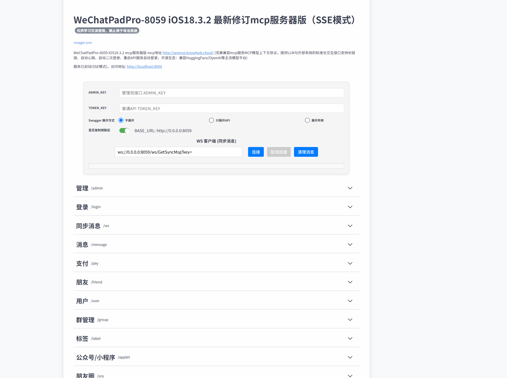

# Redis内存管理指南

## 概述

本文档提供了关于系统中Redis内存管理的详细说明，包括如何防止Redis内存泄漏问题。由于存储数据到Redis时如果不设置过期时间，数据会永久存在，这可能导致Redis内存不断增长，最终导致服务崩溃。我们已经在系统中实现了多层保护机制来防止这种情况发生。

## 自动内存管理特性

系统已经实现以下自动内存管理特性：

1. **自动过期时间设置**
   - 所有存储到Redis的数据都会自动设置24小时的默认过期时间
   - 这确保即使没有显式调用清理接口，数据也会自动过期

2. **内存限制和淘汰策略**
   - 系统启动时自动为Redis配置内存限制（默认1GB，可自适应调整）
   - 采用allkeys-lru（最近最少使用）淘汰策略，当内存接近上限时自动清理最不常用的数据

3. **定期监控和清理**
   - 系统会定期检查Redis内存使用情况
   - 当内存使用率超过阈值（默认80%）时，会增加检查频率并触发清理操作
   - 当内存使用率超过紧急阈值（默认90%）时，会触发紧急清理操作

4. **自适应内存管理**
   - 系统会根据主机可用内存自动调整Redis的内存限制
   - 会自动为不同类型的数据设置不同的过期时间
   - 根据内存使用情况，自动调整检查频率

5. **智能清理策略**
   - 优先清理大键和即将过期的键
   - 区分关键数据和非关键数据，确保重要数据不会被意外删除
   - 支持手动触发清理操作，应对突发内存压力

## 内存管理API

系统提供了REST API接口用于监控和管理Redis内存：

```
GET /api/v1/other/RedisMemory?action=stats
```
获取Redis内存统计信息，包括当前使用内存、最大内存、内存使用率等。

```
GET /api/v1/other/RedisMemory?action=cleanup
```
触发手动清理操作，清理大键以释放内存空间。

```
GET /api/v1/other/RedisMemory?action=adaptive&enabled=true
```
启用或禁用自适应内存管理模式。设置`enabled=false`可以使用固定内存限制。

## 手动配置方法

虽然系统已经实现自动内存管理，但在某些情况下您可能需要手动调整配置：

### 使用配置脚本

我们提供了Windows和Linux/macOS下的配置脚本：

#### Windows系统:
```
scripts\config_redis_memory.bat [host] [port] [password] [maxmemory] [policy]
```

#### Linux/macOS系统:
```
bash scripts/config_redis_memory.sh [host] [port] [password] [maxmemory] [policy]
```

参数说明：
- host: Redis服务器地址，默认localhost
- port: Redis端口，默认6379
- password: Redis密码，默认为空
- maxmemory: 最大内存限制，默认1GB
- policy: 内存淘汰策略，默认allkeys-lru

### 直接修改Redis配置文件

您也可以直接编辑Redis配置文件（通常是redis.conf或redis.windows.conf）：

```
# 设置最大内存为1GB
maxmemory 1GB

# 设置内存淘汰策略为LRU算法（最近最少使用）
maxmemory-policy allkeys-lru
```

修改后需要重启Redis服务才能生效。

## 内存淘汰策略说明

Redis提供了多种内存淘汰策略，适用于不同的业务场景：

- **noeviction**: 内存不足时拒绝写入新数据，返回错误
- **allkeys-lru**: 删除最近最少使用的键（推荐用于一般缓存）
- **volatile-lru**: 仅从设置了过期时间的键中删除最少使用的
- **allkeys-random**: 随机删除键
- **volatile-random**: 仅从设置了过期时间的键中随机删除
- **volatile-ttl**: 删除最接近过期的键

对于本系统，我们推荐使用**allkeys-lru**策略，因为它能够最有效地防止内存泄漏，确保系统稳定运行。

## 最佳实践

为了避免Redis内存问题，建议遵循以下最佳实践：

1. 为所有Redis数据设置合理的过期时间
2. 将Redis内存限制设置为可用物理内存的60-70%
3. 定期监控Redis内存使用情况
4. 使用适当的数据结构，避免存储过大的对象
5. 考虑使用Redis集群分担负载
6. 利用系统提供的内存管理API定期检查内存状态

## 故障排查

如果您遇到Redis内存相关问题，可以：

1. 通过API `/api/v1/other/RedisMemory?action=stats` 查看内存使用情况
2. 执行`redis-cli info memory`查看详细内存信息
3. 使用`redis-cli --bigkeys`找出大体积键
4. 检查日志中的OOM（内存不足）错误
5. 验证内存限制是否正确设置：`redis-cli config get maxmemory`
6. 确认淘汰策略是否生效：`redis-cli config get maxmemory-policy`
7. 如果内存使用率高，可以通过API `/api/v1/other/RedisMemory?action=cleanup` 触发紧急清理

如果问题持续存在，可以联系系统管理员获取进一步支持。 